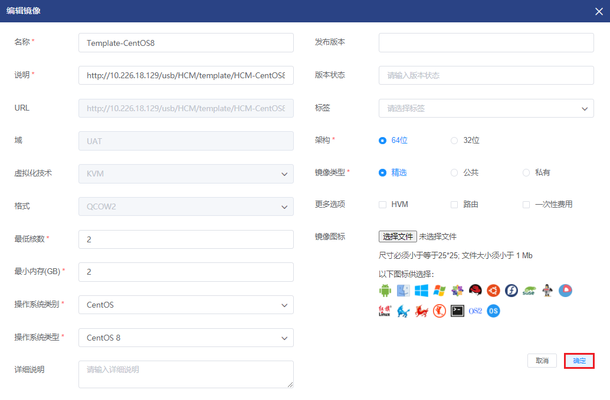

# 4.4.2.镜像管理

镜像可用于启动虚拟机的操作系统映像，ISO包含操作系统数据可启动介质的磁盘映像。

用户可以选择封装好的镜像或ISO创建虚拟机，极大提升效率，方便快捷。

在“资源管理”菜单下选择左侧“区域管理”导航菜单，之后点击“镜像”的子菜单，即可看到镜像的管理界面：

在此页面，可以查看镜像的名称、创建日期、格式、大小、状态、所有者、密码启用、说明和操作列。

镜像的管理界面分为所有、精选、公共和私有四个界面，默认显示的是所有界面：

- 所有：用户有权限编辑和使用的精选、公共、私有类的镜像和ISO镜像。
- 精选：具有完善配置、推荐使用的镜像和ISO镜像。管理员可将私有镜像/镜像设置为精选镜像/镜像，该镜像/镜像将出现在精选列表中。
- 公共：所有用户均可编辑和使用的镜像和ISO镜像。用户可将私有镜像/镜像设置为公共镜像/镜像，该镜像/镜像将出现在公共列表中。
- 私有：用户上传的镜像和ISO镜像均为私有类，仅用户可以编辑和使用，可以将私有类修改为精选类或公共类。

云平台中，镜像的状态有两种：

- ACTIVE：处于可用状态的镜像，支持用户使用当前镜像创建虚拟机；
- INACTIVE：正在上传或上传失败的镜像，不支持用户使用。

云平台中，镜像的种类有两种：

- 镜像：包含操作系统的磁盘镜像，由不同操作系统的虚拟机并自定义安装服务(例如zabbix filebeat 等工具)封装而成，用户可以选择不同的模板创建虚拟机。
- ISO：用户刻录或从官网下载的可安装系统光盘，用户可以选择不同的ISO镜像创建虚拟机。

## 相关操作

HYPERX云管理平台支持用户对镜像进行管理，支持的功能如下：

- 全部标签：根据镜像的标签搜索镜像；
- 所有镜像：根据镜像的格式搜索镜像；
- 快速搜索：根据镜像的名称、说明、状态等字段全局快速搜索镜像；
- 高级筛选：用户可以从表头右侧根据名称、操作系统、虚拟化属性等字段筛选出符合条件的镜像；
- 创建镜像：输入镜像的URL在当前区域中创建镜像；
- 创建ISO：输入ISO的URL在当前区域中创建ISO；
- 选定镜像创建虚拟机：使用选定的镜像创建一个或多个虚拟机；
- 编辑镜像：编辑镜像的名称、说明、URL等相关信息；
- 删除镜像：彻底删除选定的镜像，其操作结果不影响之前使用该镜像创建的虚拟机。

操作入口如下：

- 资源管理→区域管理→镜像(用于注册、编辑、启用或删除镜像和镜像)
- 资源管理→虚拟资源管理→虚拟机

## 操作说明

### 创建镜像

① 在镜像管理界面中，点击“创建公共镜像”按钮，选择“创建镜像”菜单：

② 选择创建镜像后，将会进入创建镜像(公共)页面，上传镜像的信息后，点击“确定”按钮，即可实现镜像的创建：

> [!NOTE]
>
> - 在创建镜像前，要确保该镜像所有者所在的部门拥有足够的配额剩余资源。
> - 如果选择URL上传：
>   - 镜像通过HTTP或HTTPS协议传输，需要将计划上传的镜像或ISO文件存储在支持HTTP协议的服务器上。
>   - 如需测试镜像(或ISO镜像)是否可用，可以在浏览器中输入HTTP服务器的地址访问镜像(或ISO镜像)的URL，如果弹出下载窗口，则证明HTTP服务器可用。
>   - URL的命名标准为“http://HTTP服务器的IP地址/镜像文件名”；
> - 如果选择文件目录上传：
>   - 镜像需要从文件资源管理模块上传本地文件至文件目录。

### 创建ISO镜像

① 在镜像管理界面中，点击“创建公共镜像”按钮，选择“创建ISO镜像”菜单：

② 选择创建ISO镜像后，将会进入创建ISO镜像(公共) 页面，完善ISO镜像的信息后，点击“确定”按钮，即可实现ISO镜像的创建：

> [!NOTE]
>
> - 在创建ISO镜像前，要确保该ISO镜像所有者所在的部门拥有足够的配额剩余资源。
> - 如果选择URL上传：
>   - 镜像通过HTTP或HTTPS协议传输，需要将计划上传的镜像或ISO文件存储在支持HTTP协议的服务器上。
>   - 如需测试镜像(或ISO镜像)是否可用，可以在浏览器中输入HTTP服务器的地址访问镜像(或ISO镜像)的URL，如果弹出下载窗口，则证明HTTP服务器可用。
>   - URL的命名标准为“http://HTTP服务器的IP地址/ISO镜像文件名”；
> - 如果选择文件目录上传：
>   - 镜像需要从文件资源管理模块上传本地文件至文件目录。

### 编辑镜像

① 在镜像管理界面中，选择需要编辑信息的镜像，点击操作列的“编辑”按钮：           

② 将会弹出“编辑镜像“的操作提示框，完善相关信息后，点击“确定”按钮，即可实现镜像的编辑。

> [!WARNING]
>
> - 镜像的URL、域、虚拟化技术和格式不支持编辑。

### 选定镜像创建虚拟机

① 在镜像管理界面中，选择需要创建虚拟机的镜像，点击操作列的“启动”按钮：

② 即可跳转到虚拟机的创建页面，并自动选择当前镜像(或ISO镜像)，如需了解创建虚拟机的方法，请查阅虚拟机的创建章节：

> [!NOTE]
>
> - 在选用镜像或ISO镜像前，要确保镜像处于ACTIVE状态可用。
> - 自动选择镜像为创建虚拟机的第二步，需要用户先完善第一页的信息后才能看到该界面；
> - 在选用镜像创建虚拟机前，要确保该虚拟机所有者所在的部门拥有足够的配额剩余资源。

### 删除镜像

① 在镜像管理界面中，选择需要删除的镜像(或ISO镜像)后，点击操作列的“删除”按钮：

② 将会弹出”删除“的操作提示框，点击“确认”按钮后，将删除选中的镜像：

> [!NOTE]
>
> - 删除镜像后，原先使用该镜像创建的虚拟机不会受到影响。